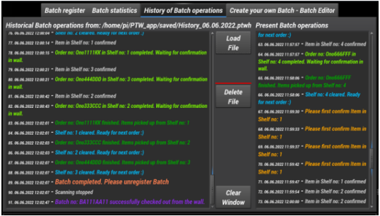

# Put to Wall - project
It is a fully functional system that implements the Put to Wall idea. 
It was created as a graduation project.
The system is designed to support the processing of multi-item orders, in terms of assigning products (collected from racks to common collective trolleys) to the corresponding orders.
It supports the operator's work by speeding up and simplifying the entire process. It eliminates the need to manually verify each product in the order database and minimizes the risk of errors during the logistics process.
Dedicated to e-commerce.

### The hardware part (order picking wall) is described in another repository
### This is the control software written in Pyside 2 - designed for Raspberry Pi 4B 4GB

## The application performs the following functions:
- scanning barcodes of products in order to identify them,
- control and supervision of the correct distribution of products by the operator,
- presentation of information necessary for the proper conduct of the process,
(light, visual and sound signaling) - both in the hardware part
model and on the screen - properly to the actions of the user (system operator),
- two-way communication microcontroller - control application via UART interface,
- informing about all performed operations in log window,
- updating data in the database,
- aggregation of statistical and historical data and their saving to a file,
- editing and creating your own Batch's (order lists) for testing purposes,
- displaying a cumulative list of products for Batch test preparation,
- the model has 9  compartments in which orders are completed.

The application dashboard is presented below.

#### Additionally, it's possible to:

##### Create of your own Batch's

##### View process statistics

##### View the history of all operations (log)

## Screenshots and link to video of the running system:
https://drive.google.com/file/d/1f3fa0PJuYuoikj30Qx1oXA68JuWe_ym5/view?usp=sharing

